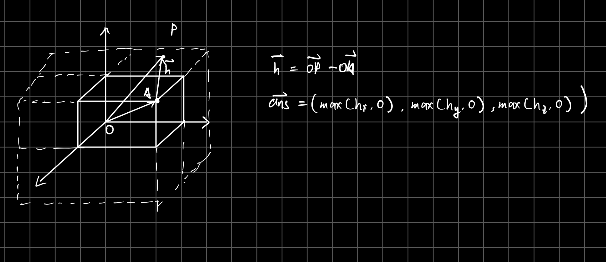

# 这是一个用于做碰撞检测的项目
## 项目简介
这是一个用于做三维碰撞检测的项目，主要是用于检测两个物体是否发生碰撞，如果发生碰撞，就会返回碰撞的穿透深度和方向。
支持对象如下：
+ Sphere：球形碰撞体
+ Capsule：胶囊碰撞体
+ Box：盒子碰撞体
+ Convex：凸包多边形碰撞体，支持凸包类型的mesh输入

## 计算方式

| 碰撞体 | Sphere | Capsule | Box | Convex |
| --- | --- | --- | --- | --- |
| Sphere | 常规几何计算 | 常规几何计算 | 特殊算法1 | 闵可夫斯基差 |
| Capsule | 常规几何计算 | 常规几何计算 | 特殊算法2 | 闵可夫斯基差 |
| Box | 特殊算法1 | 特殊算法2 | 特殊算法3 | 闵可夫斯基差 |
| Convex | 闵可夫斯基差 | 闵可夫斯基差 | 闵可夫斯基差 | 闵可夫斯基差 |

### 特殊算法1:
以盒子的中心为原点，盒子的长宽高为坐标轴,对球心坐标做变换，使用下图方法求box到球心的最短距离，和球心做比较）

### 特殊算法2:
胶囊体本身也是一个线段，本方法分两步
1. 求胶囊体两端点到立方体的最小距离（该方案参考特殊算法1）
2. 将立方体的12条边，每条分别求与胶囊体线段的最短距离，取最小值
3. 比较两个最小值，取最小值
将最小值与胶囊体的半径比较做差即可